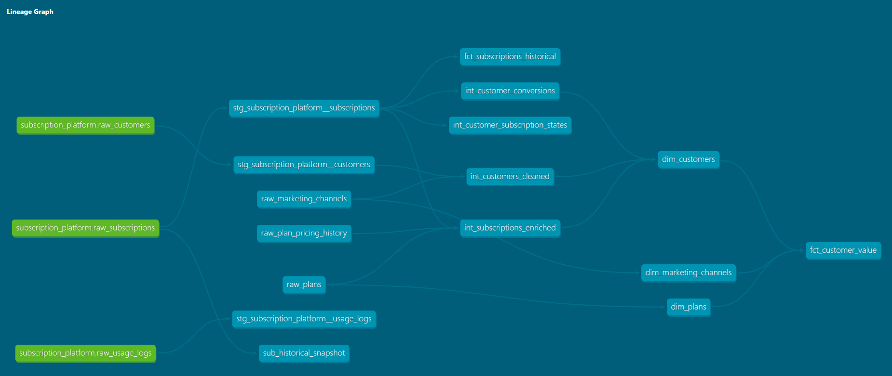
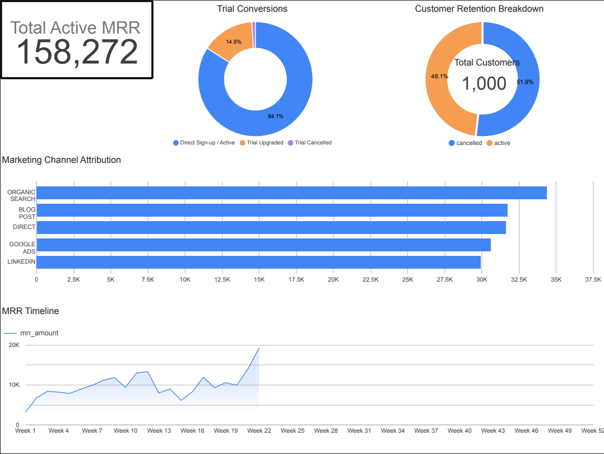

# 🚀 Subscription SaaS Analytics Platform (dbt Core + Google BigQuery)

An end-to-end modern data stack pipeline that transforms raw transactional data from a subscription-based SaaS platform into an optimized, star-schema analytics data mart. 

This project simulates complex real-world data engineering challenges, including tracking historical subscription price adjustments over time, data validation via custom Jinja macros, multi-layer data cleaning, and implementing cost-effective incremental loading strategies.

---

## 🏗️ Warehouse Architecture & Data Lineage

This warehouse is built using a modular, multi-layer architecture following dbt implementation best practices to isolate ingestion from business logic:

`Raw (Seeds) ──> Staging (stg_) ──> Intermediate (int_) ──> Marts (dim_ / fct_)`

### Pipeline Lineage Graph
  
*(To view dynamically, run `dbt docs generate` and `dbt docs serve` locally).*

### Data Layer Breakdown:
1. **Source Layer (Seeds):** Raw CSV snapshots mimicking production databases (`raw_customers`, `raw_subscriptions`, `raw_usage_logs`) along with normalized lookup dimensions (`raw_plans`, `raw_plan_pricing_history`, `raw_marketing_channels`).
2. **Staging Layer (`stg_`):** 1-to-1 views mapping raw assets. Performs basic column renaming, string trimming, and initial type casting without introducing joins or heavy business filters.
3. **Intermediate Layer (`int_`):** The operational engine room. Handles multi-table normalization joins, calculates temporal window states, and runs custom validation macros. Kept private from downstream BI layers.
4. **Marts Layer (`dim_` / `fct_`):** High-performance physical tables serving as the final semantic layer for business intelligence tools, tracking current states and historical facts.

---

## 🛠️ Tech Stack & Infrastructure

* **Data Warehouse:** Google BigQuery (Serverless, Columnar OLAP architecture)
* **Transformation Engine:** dbt Core v1.11 (Jinja-SQL compiler & orchestration)
* **Language:** ANSI SQL
* **Version Control:** Git & GitHub
* **Development Environment:** VS Code & Python Virtual Environment (`venv`)

---

## 🧠 Core Engineering Highlights

### 1. Advanced Normalization & Historic Pricing Log (SCD Type 2)
To model shifting financial metrics accurately, the project decouples plans from flat records and utilizes a **Slowly Changing Dimension (SCD Type 2)** structure (`raw_plan_pricing_history`). The intermediate layer dynamically maps subscription events to active price scales based on historical timestamp boundaries:
```sql
left join ref_pricing pr 
    on p.plan_id = pr.plan_id
    and s.valid_from_date >= pr.valid_from
    and (s.valid_from_date < pr.valid_to or pr.valid_to is null)
```
### 2. High-Performance Incremental Processing (merge strategy)
To minimize BigQuery query computation costs, the main fact table (fct_subscriptions_historical) uses an Incremental Materialization strategy. Rather than rebuilding the table from scratch, dbt writes a target MERGE statement to update modified historical keys and append new records seamlessly based on unique keys:

```yaml
marts:
  core:
    fct_subscriptions_historical:
      +materialized: incremental
      +incremental_strategy: merge
      +unique_key: subscription_id
### 3. Custom Jinja Macro Data Validation
Data quality is enforced programmatically in the intermediate layer. A custom Jinja macro (validate_email) wraps a complex regular expression evaluation to validate account strings and generate an execution flag before records are exposed to production dashboards:
```
```sql

    case 
        when regexp_contains({{ column_name }}, r"^[a-zA-Z0-9_.+-]+@[a-zA-Z0-9-]+\.[a-zA-Z0-9-.]+$") then true
        else false
    end

```
---

## 📂 Project Directory Structure

```text
dbt-bigquery-portfolio-project/
    ├──  images/
    │    ├──  bi_dashboard.png
    │    ├──  prod_lineage.png
    ├──  logs/
    │    ├──  dbt.log
    ├──  macros/
    │    ├──  validate_email.sql
    ├──  models/
    │    ├──  intermediate/
    │    │    ├──  int_customers_cleaned.sql
    │    │    ├──  int_customer_conversions.sql
    │    │    ├──  int_customer_subscription_states.sql
    │    │    ├──  int_subscriptions_enriched.sql
    │    │    ├──  _schema__intermediate.yml
    │    ├──  marts/
    │    │    ├──  core/
    │    │    │    ├──  dim_customers.sql
    │    │    │    ├──  dim_marketing_channels.sql
    │    │    │    ├──  dim_plans.sql
    │    │    │    ├──  fct_customer_value.sql
    │    │    │    ├──  fct_subscriptions_historical.sql
    │    │    │    ├──  _schema__marts.yml
    │    ├──  staging/
    │    │    ├──  subscription_platform/
    │    │    │    ├──  stg_subscription_platform__customers.sql
    │    │    │    ├──  stg_subscription_platform__subscriptions.sql
    │    │    │    ├──  stg_subscription_platform__usage_logs.sql
    │    │    │    ├──  _subscription_platform.yml
    ├──  scripts/
    │    ├──  mock_customer_data_creation.py
    ├──  seeds/
    │    ├──  raw_customers.csv
    │    ├──  raw_marketing_channels.csv
    │    ├──  raw_plans.csv
    │    ├──  raw_plan_pricing_history.csv
    │    ├──  raw_subscriptions.csv
    │    ├──  raw_usage_logs.csv
    │    ├──  _schema__models.yml
    ├──  snapshots/
    │    ├──  sub_historical_snapshot.sql
    ├──  dbt_project.yml
    ├──  README.md
```            
---

## 🧪 Data Quality & Testing Contracts

Robust data contracts are enforced via strict schema documentation and tests inside _core__models.yml. The platform utilizes built-in and relational validation constraints:

Primary Key Verification: unique and not_null assertions applied across all dimensional entities.

Foreign Key Constraints: Dynamic relationships tests ensuring every fact entity ties directly back to a valid dimension block.

Schema Contracts: Enabled contract: enforced: true to prevent schema drift from breaking downstream BI tools.

To execute the verification matrix locally:

Bash
dbt build --no-partial-parse

## 📈 Executive Deliverables (Business Metrics)

The final presentation mart layer exposes business-critical dimensions optimized for BI tools (e.g., Google Looker Studio), tracking core SaaS KPIs:

Monthly Recurring Revenue (MRR): Calculated dynamically across account cohorts even through price changes.

Customer Lifecycle States: Tracking healthy, canceled, and churned accounts over operational timelines.

Funnel Attribution: Correlating marketing acquisition channels directly against recurring billing values.

### 📊 Business Intelligence Dashboard
 

---

## 🛡️ Data Governance, Privacy, & Compliance Oversight

To simulate a highly regulated corporate environment (e.g., GDPR/CCPA compliance), this platform implements three foundational governance pillars:

### 1. Automated Quality Gateways & Schema Contracts
Data contracts are programmatically enforced at the **Intermediate Layer** using strict schema constraints (`contract: enforced: true`). If upstream source systems introduce data drift or unexpected column types, dbt blocks the compilation before dirty assets propagate to the production warehouse.

### 2. Custom Data Quality Controls (Jinja Macro)
A custom validation engine runs a regex evaluation macro on sensitive customer profile strings. Downstream models utilize an assertion test (`accepted_values: [true]`) to dynamically flag and isolate non-compliant records for security triage.

### 3. Model Auditability & Reproducibility (SCD Type 2)
To provide absolute historical lineage for downstream financial audits or ML model training tracking, the platform utilizes **dbt Snapshots**. This builds an immutable time-gated log of subscription lifecycle modifications, capturing exact historical state records over time:
* **Tracking Strategy:** `check` (Monitoring delta changes on `status` and `monthly_amount`)
* **Lineage Tracking:** Automatically injects system temporal fields (`dbt_valid_from` to `dbt_valid_to`) to preserve historical point-in-time contexts perfectly.